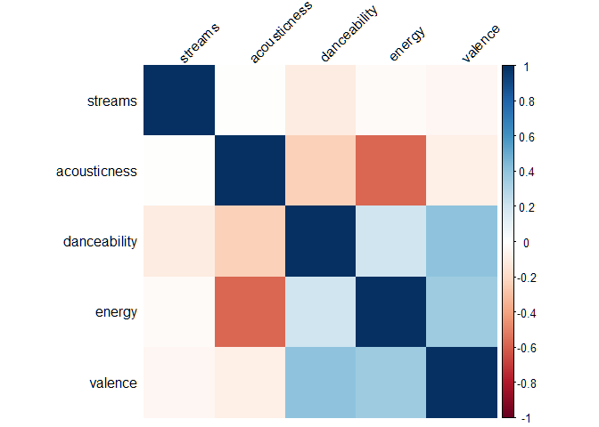
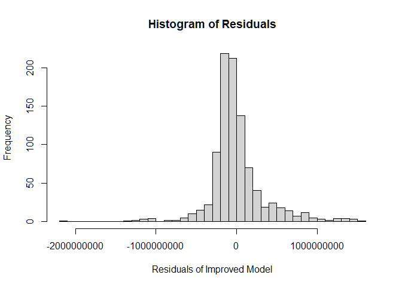
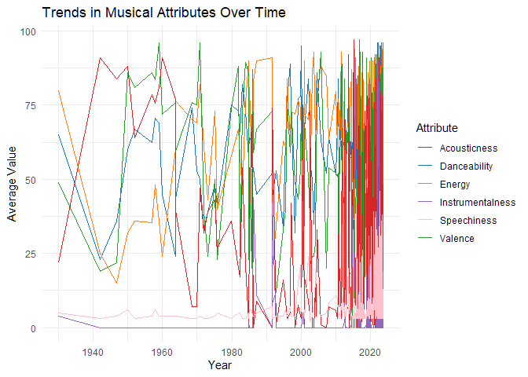
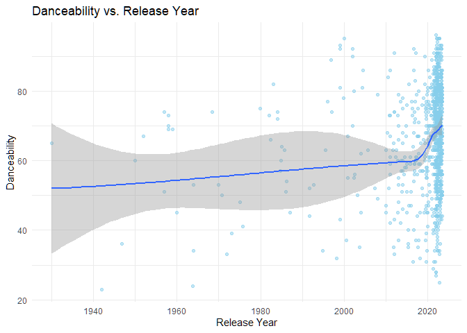
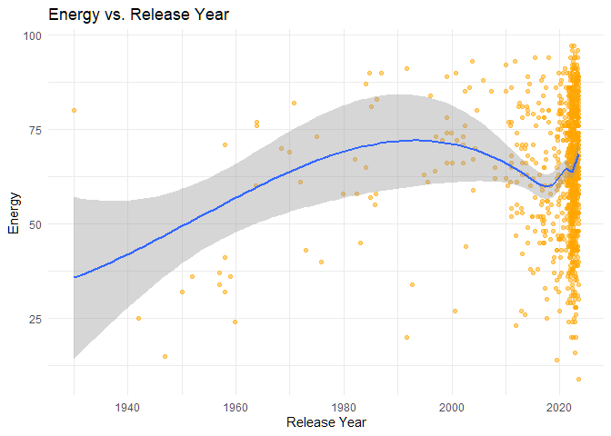
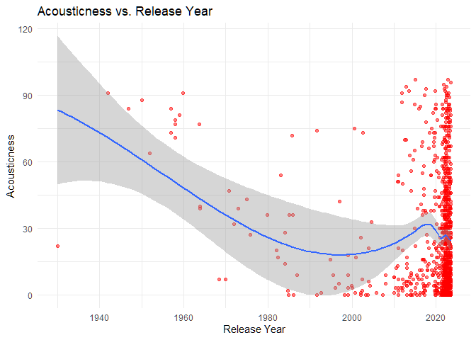
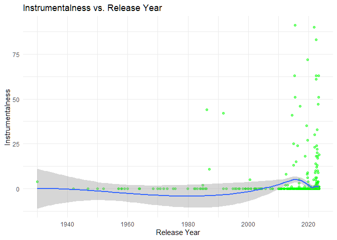
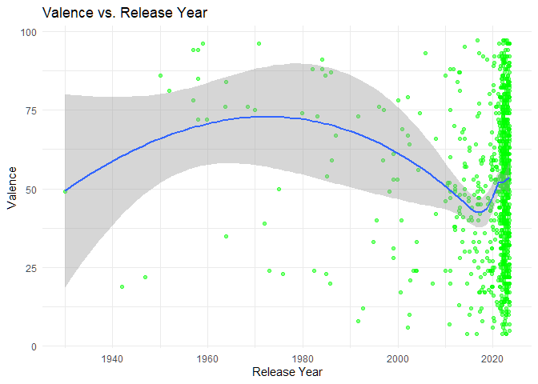
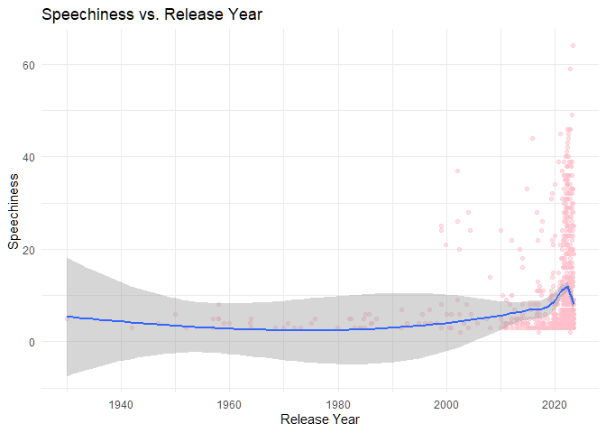

## Introduction and Problem Statement

## Introduction

-   For this Analysis we will be using the Spotify Most Streamed Songs
    dataset that I found on Kaggle.

-   The goal of this analysis is to analyze the characteristics of a
    song that contribute to its popularity on Spotify.

-   The questions we want to answer are as follows:

    -   How do musical attributes (like energy, danceability etc.)
        relate to song popularity?
    -   What trends in musical characteristics have emerged over time?

## Loading the data

First we load the data from the csv and see how it looks.

``` r
spotify_data <- read.csv("Spotify Most Streamed Songs.csv")
colnames(spotify_data)
```

    ##  [1] "track_name"           "artist.s._name"       "artist_count"        
    ##  [4] "released_year"        "released_month"       "released_day"        
    ##  [7] "in_spotify_playlists" "in_spotify_charts"    "streams"             
    ## [10] "in_apple_playlists"   "in_apple_charts"      "in_deezer_playlists" 
    ## [13] "in_deezer_charts"     "in_shazam_charts"     "bpm"                 
    ## [16] "key"                  "mode"                 "danceability_."      
    ## [19] "valence_."            "energy_."             "acousticness_."      
    ## [22] "instrumentalness_."   "liveness_."           "speechiness_."       
    ## [25] "cover_url"

## Dataset Overview

-   **Source**: From Kaggle -
    <https://www.kaggle.com/spotify_datasets/abdulszz/spotify-most-streamed-songs>
-   **Key Variables**:
    -   Basic track info (“track_name”, “artist_name”, “released_year”
        etc.)
    -   Streaming metrics (“streams”, “in_spotify_playlists”,
        “in_apple_charts” etc.)
    -   Musical attributes (“bpm”, “danceability\_.”, “energy\_.”,
        “valence\_.” etc.)

## Cleaning the spotify_data

We check the data set for any missing values

``` r
sum(is.na(spotify_data))
```

    ## [1] 0

We don’t have any missing values.

Next we will create a single column for the release date of songs and
clean the rest of the data.

``` r
spotify_data$release_date <- as.Date(paste(spotify_data$released_year,
    spotify_data$released_month, spotify_data$released_day,
    sep = "-"), "%Y-%m-%d")

# Renaming columns for readability
spotify_data <- spotify_data %>%
    rename(danceability = danceability_., energy = energy_.,
        valence = valence_., acousticness = acousticness_.,
        instrumentalness = instrumentalness_., speechiness = speechiness_.,
        playlists = in_spotify_playlists, charts = in_spotify_charts)

# Now that we have a single column for the release
# date we can remove the other columns from the data
# set
spotify_data <- spotify_data[, !names(spotify_data) %in%
    c("released_year", "released_month", "released_day")]
```

## Exploratory Data Analysis

``` r
# Basic summary for key metrics
s <- summary(spotify_data[c("streams", "acousticness", "danceability",
    "energy", "valence")])

# presenting the data in a clean manner
knitr::kable(s)
```

|     | streams          | acousticness  | danceability  | energy        | valence       |
|:---|:---------------|:------------|:------------|:------------|:------------|
|     | Length:953       | Min. : 0.00   | Min. :23.00   | Min. : 9.00   | Min. : 4.00   |
|     | Class :character | 1st Qu.: 6.00 | 1st Qu.:57.00 | 1st Qu.:53.00 | 1st Qu.:32.00 |
|     | Mode :character  | Median :18.00 | Median :69.00 | Median :66.00 | Median :51.00 |
|     | NA               | Mean :27.06   | Mean :66.97   | Mean :64.28   | Mean :51.43   |
|     | NA               | 3rd Qu.:43.00 | 3rd Qu.:78.00 | 3rd Qu.:77.00 | 3rd Qu.:70.00 |
|     | NA               | Max. :97.00   | Max. :96.00   | Max. :97.00   | Max. :97.00   |

## Correlation Analysis

Here we will explore the correlations between musical attributes and
streaming metrics to identify any relationships.

``` r
spotify_data$streams <- as.numeric(spotify_data$streams)
spotify_data$acousticness <- as.numeric(spotify_data$acousticness)
spotify_data$danceability <- as.numeric(spotify_data$danceability)
spotify_data$energy <- as.numeric(spotify_data$energy)
spotify_data$valence <- as.numeric(spotify_data$valence)

cor_matrix <- cor(spotify_data[, c("streams", "acousticness",
    "danceability", "energy", "valence")], use = "complete.obs")
corrplot(cor_matrix, method = "color", tl.col = "black",
    tl.srt = 45)
```



## Interpretation

**Streams Correlations:**

-Has a very weak negative correlation with danceability -Has a weak
negative correlation with acousticness -Shows minimal correlation with
energy and valence -This suggests that a song’s musical characteristics
don’t strongly predict its streaming success, as we will also find out
with our statistical modelling later on.

**Negative Correlations:** -Energy and Acousticness show a strong
negative correlation (dark red) ~ -0.7 to -0.8 -This makes intuitive
sense: highly acoustic songs tend to have lower energy levels, and vice
versa.

**Positive Correlations:**

-Valence and Energy show a moderate positive correlation (light blue) ~
0.3 to 0.4 -This suggests that more energetic songs tend to be slightly
more positive/upbeat -Danceability and Energy show a weak positive
correlation

## Statistical Modeling

### Simple Linear Regression Model

To understand the impact of musical attributes on popularity, we will
use a simple linear regression model to predict `streams` based on
`danceability`, `energy`, and `valence`.

``` r
# Linear regression model
lm_model <- lm(streams ~ danceability + energy + valence,
    data = spotify_data)
summary(lm_model)
```

    ## 
    ## Call:
    ## lm(formula = streams ~ danceability + energy + valence, data = spotify_data)
    ## 
    ## Residuals:
    ##        Min         1Q     Median         3Q        Max 
    ## -623160933 -364934497 -205075845  158613173 3125195173 
    ## 
    ## Coefficients:
    ##               Estimate Std. Error t value Pr(>|t|)    
    ## (Intercept)  798373794  102831427   7.764 2.13e-14 ***
    ## danceability  -4114896    1374341  -2.994  0.00282 ** 
    ## energy         -232995    1186081  -0.196  0.84431    
    ## valence         123960     898747   0.138  0.89033    
    ## ---
    ## Signif. codes:  0 '***' 0.001 '**' 0.01 '*' 0.05 '.' 0.1 ' ' 1
    ## 
    ## Residual standard error: 564600000 on 948 degrees of freedom
    ##   (1 observation deleted due to missingness)
    ## Multiple R-squared:  0.01117,    Adjusted R-squared:  0.008039 
    ## F-statistic: 3.569 on 3 and 948 DF,  p-value: 0.01376

### Significance of Predictors:

-Danceability: The coefficient for danceability is statistically
significant with a p-value of 0.00282, indicating a meaningful
relationship between danceability and streams. However, the negative
coefficient suggests that, on average, as danceability increases, the
number of streams slightly decreases, which is counterintuitive and
could indicate the influence of other factors not captured by this
model.

-Energy and Valence: Neither energy (p-value = 0.84431) nor valence
(p-value = 0.89033) are statistically significant predictors of streams
based on this model, as their p-values are far above the standard 0.05
threshold. This suggests that, in isolation, these attributes do not
have a strong influence on streaming counts in this dataset.

-The R-squared value is only 0.01117, which means it explains only about
1.1% of the variance in streaming counts. This signifies that there are
other factors outside of this model influencing a song’s popularity, or
perhaps we just don’t have enough data.

## Overall Model Significance

The F-statistic (3.569) and its p-value (0.01376) suggest that, while
the model as a whole has a slightly statistically significant result,
the actual impact on explaining the variance in streams is minimal. Thus
this model is not that useful in practice.

# Improving the Model

Since the model we created was not that useful, now we can try to create
a more complex model that can hopefully give us some insight into a
songs popularity.

-   To improve the model we will include additional variables such as
    bpm, in_spotify_playlists(the number of spotify playlists a song is
    in), in_spotify_charts (the number of charts a song is in) and
    acousticness.

``` r
model <- lm(streams ~ danceability + energy + valence +
    bpm + playlists + charts + acousticness, data = spotify_data)

summary(model)
```

    ## 
    ## Call:
    ## lm(formula = streams ~ danceability + energy + valence + bpm + 
    ##     playlists + charts + acousticness, data = spotify_data)
    ## 
    ## Residuals:
    ##        Min         1Q     Median         3Q        Max 
    ## -2.128e+09 -1.592e+08 -5.724e+07  8.538e+07  1.564e+09 
    ## 
    ## Coefficients:
    ##               Estimate Std. Error t value Pr(>|t|)    
    ## (Intercept)  270867516  102912510   2.632  0.00863 ** 
    ## danceability   -279805     875983  -0.319  0.74948    
    ## energy        -1504652     888227  -1.694  0.09060 .  
    ## valence        -202391     561913  -0.360  0.71879    
    ## bpm             189533     401561   0.472  0.63704    
    ## playlists        55366       1433  38.642  < 2e-16 ***
    ## charts         3597909     573876   6.269  5.5e-10 ***
    ## acousticness    539246     544537   0.990  0.32229    
    ## ---
    ## Signif. codes:  0 '***' 0.001 '**' 0.01 '*' 0.05 '.' 0.1 ' ' 1
    ## 
    ## Residual standard error: 340300000 on 944 degrees of freedom
    ##   (1 observation deleted due to missingness)
    ## Multiple R-squared:  0.6422, Adjusted R-squared:  0.6396 
    ## F-statistic: 242.1 on 7 and 944 DF,  p-value: < 2.2e-16

This model seems to give us much better results. - The model explains
about 64.2% of the variance in streams which is much better than our
previous model. - The overall model is also highly significant.

## Plotting the Residual

``` r
options(scipen = 999)
hist(residuals(model), main = "Histogram of Residuals",
    xlab = "Residuals of Improved Model", breaks = 30)
```

 The
histogram appears to have a fairly normal distribution, implying a
decent fit, however the values of the residuals are quite large. This
could mean that some of our predictions are quite far off.

### Significance of Predictors:

-   The most significant change we see is in the relationship of
    **streams vs in_spotify_playlists** and **streams vs
    in_spotify_charts**, both of which have a very strong positive
    relationship as suggested by their p values.
-   The other song attributes such as danceability, valence,
    acousticness and bpm don’t show much statistical significance at
    all. Another interesting observation is that energy seems to show
    some statistical significance this time around, and not danceability
    like the previous model.

## Improved Model Implication

-   This new model seems to suggest that platform presence, such as the
    number of charts and playlists a song is in, contributes much more
    to streaming numbers than a song’s particular characteristics.

**One Large Caveat:** This model only suggests that there is a
correlation between platform presence and streaming variance. This in no
way implies causation. It could be the case that the more popular a song
is, the more playlists it is in and the higher it charts.

## Trends Over Time

### Average Musical Attributes by Year

To answer our second question, we analyze trends over time for song
attributes to see if there are patterns in the musical characteristics
of popular songs.

``` r
# Group by year and calculate averages
yearly_trends <- spotify_data %>%
    group_by(release_date) %>%
    summarise(avg_danceability = mean(danceability, na.rm = TRUE),
        avg_energy = mean(energy, na.rm = TRUE), avg_valence = mean(valence,
            na.rm = TRUE), avg_acousticness = mean(acousticness,
            na.rm = TRUE), avg_instrumentalness = mean(instrumentalness,
            na.rm = TRUE), avg_speechiness = mean(speechiness,
            na.rm = TRUE), )

# Plot trends over time
ggplot(yearly_trends, aes(x = release_date)) + geom_line(aes(y = avg_danceability,
    color = "Danceability")) + geom_line(aes(y = avg_energy,
    color = "Energy")) + geom_line(aes(y = avg_valence,
    color = "Valence")) + geom_line(aes(y = avg_acousticness,
    color = "Acousticness")) + geom_line(aes(y = avg_instrumentalness,
    color = "Instrumentalness")) + geom_line(aes(y = avg_speechiness,
    color = "Speechiness")) + labs(title = "Trends in Musical Attributes Over Time",
    x = "Year", y = "Average Value", color = "Attribute") +
    scale_color_manual(values = c(Danceability = "#1f77b4",
        Energy = "#ff7f0e", Valence = "#2ca02c", Acousticness = "#d62728",
        Instrumentalness = "#9467bd", Speechiness = "pink")) +
    theme_minimal()
```



This plot is not very readable at all. To better visualize the data, we
will be plotting the line graphs for each attribute separately.

## Data Visualization

### Danceability vs. Release Year

``` r
ggplot(spotify_data, aes(y = danceability, x = release_date)) +
    geom_point(alpha = 0.5, color = "skyblue") + geom_smooth(method = "loess") +
    labs(title = "Danceability vs. Release Year", x = "Release Year",
        y = "Danceability") + theme_minimal()
```



This shows a slight upwards trend, implying newer songs tend to be more
danceable.

### Energy vs. Release Year

``` r
ggplot(spotify_data, aes(y = energy, x = release_date)) +
    geom_point(alpha = 0.5, color = "orange") + geom_smooth(method = "loess") +
    labs(title = "Energy vs. Release Year", x = "Release Year",
        y = "Energy") + theme_minimal()
```

 This
shows an upwards trend in energy of songs, impying newer songs tend to
be more energetic

### Acousticness vs. Release Year

``` r
ggplot(spotify_data, aes(y = acousticness, x = release_date)) +
    geom_point(alpha = 0.5, color = "red") + geom_smooth(method = "loess") +
    labs(title = "Acousticness vs. Release Year", x = "Release Year",
        y = "Acousticness") + theme_minimal()
```



This one is quite interesting. There is a very clear **downward** trend
in song acousticness, which could be attributed to newer musics’ use of
synthesizers and electronic instruments.

### Instrumentalness vs. Release Year

``` r
ggplot(spotify_data, aes(y = instrumentalness, x = release_date)) +
    geom_point(alpha = 0.5, color = "green") + geom_smooth(method = "loess") +
    labs(title = "Instrumentalness vs. Release Year", x = "Release Year",
        y = "Instrumentalness") + theme_minimal()
```


Instrumentalness has not changed significantly over the years.

### Valence vs. Release Year

``` r
ggplot(spotify_data, aes(y = valence, x = release_date)) +
    geom_point(alpha = 0.5, color = "green") + geom_smooth(method = "loess") +
    labs(title = "Valence vs. Release Year", x = "Release Year",
        y = "Valence") + theme_minimal()
```



From the plot there doesn’t seem to be any significant trend for valence
over time

### Speechiness vs. Release Year

``` r
ggplot(spotify_data, aes(y = speechiness, x = release_date)) +
    geom_point(alpha = 0.5, color = "pink") + geom_smooth(method = "loess") +
    labs(title = "Speechiness vs. Release Year", x = "Release Year",
        y = "Speechiness") + theme_minimal()
```



We would expect speechiness to go up over the years but this is not the
case, it remains fairly constant.

## Conclusion

This analysis of Spotify’s most streamed songs has revealed several
interesting insights about music trends and the factors influencing song
popularity.

### Key Findings on Song Popularity

-   The initial simple linear regression model showed that musical
    attributes alone (danceability, energy, and valence) are poor
    predictors of streaming success, explaining only 1.1% of the
    variance in streaming numbers.

-   The improved model, which included platform presence metrics
    (playlist inclusion and chart presence), explained approximately
    64.2% of the streaming variance. This suggests that a song’s
    visibility on the platform is much more strongly correlated with its
    streaming success than its musical characteristics.

### Notable Musical Trends Over Time

-   **Increasing Danceability**: Modern songs show a clear upward trend
    in danceability scores, indicating a shift towards more
    rhythm-driven, danceable music.

-   **Declining Acousticness**: There is a significant downward trend in
    acousticness over time, likely reflecting the increasing adoption of
    electronic and synthesized instruments in contemporary music
    production.

-   **Stable Metrics**: Several attributes remained relatively constant
    over time:

    -   Instrumentalness showed no significant changes
    -   Valence (emotional positivity) remained stable
    -   Speechiness levels stayed consistent, contrary to what might be
        expected

### Limitations and Considerations

-   While the correlation between platform presence and streams is
    strong, this analysis cannot determine causation – high streaming
    numbers might lead to more playlist inclusions, or vice versa.
-   The residual analysis of our improved model showed that while the
    distribution was fairly normal, the large residual values suggest
    some predictions may be significantly off.
-   The dataset contains around 950 songs, which is not too large of a
    sample set.

## Dataset Citation:

Abdullah, M. (2024, September 7). Spotify most streamed songs. Kaggle.
<https://www.kaggle.com/datasets/abdulszz/spotify-most-streamed-songs>
